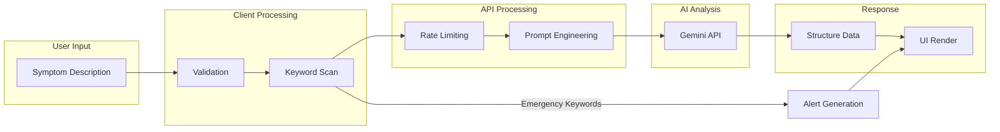
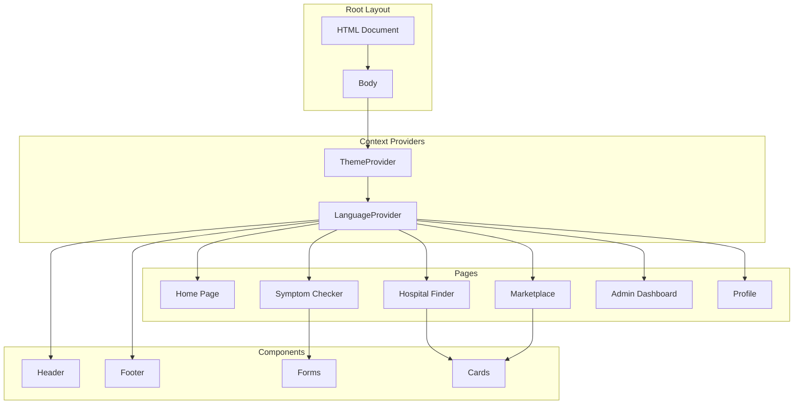
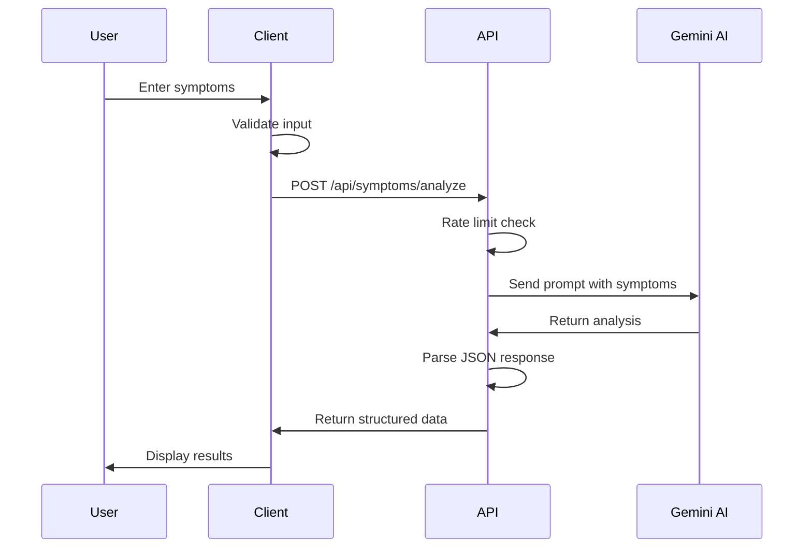
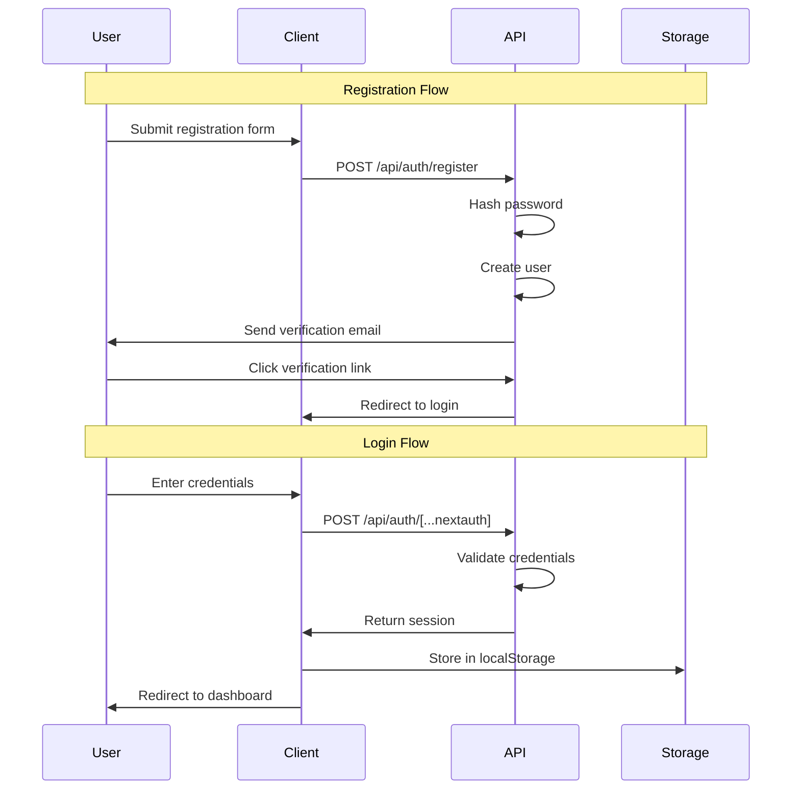
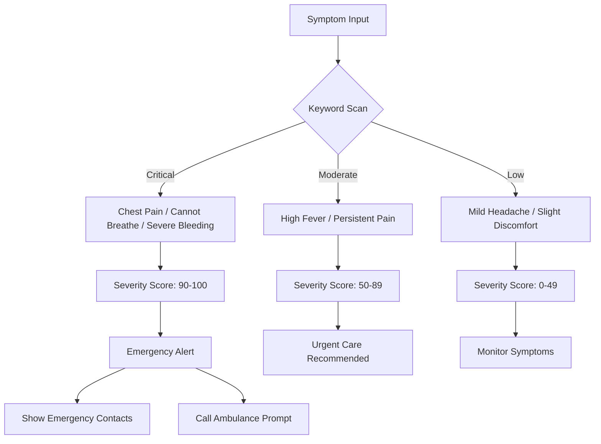
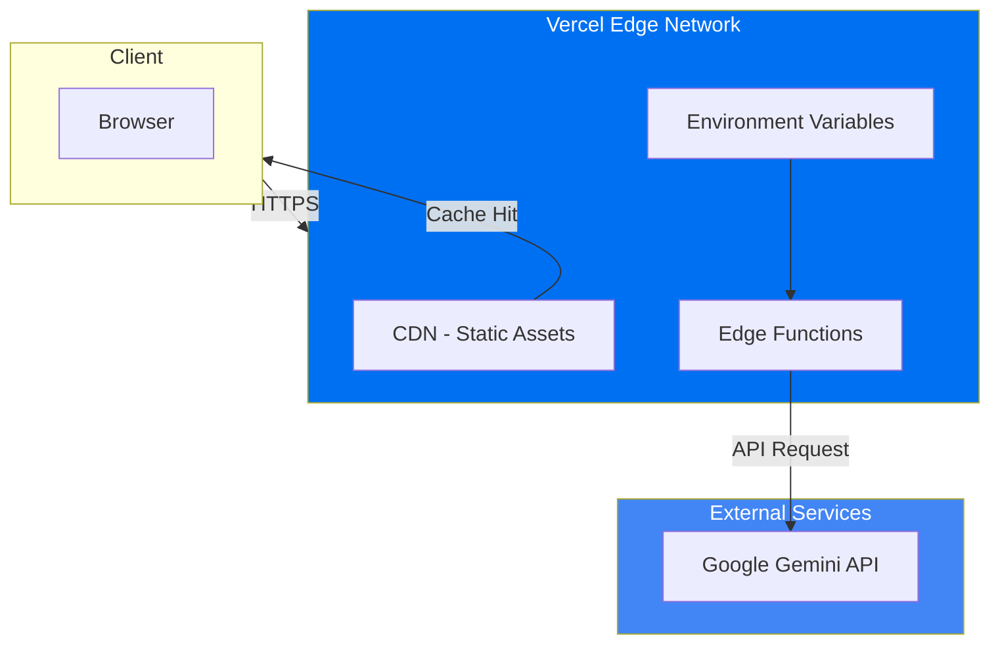
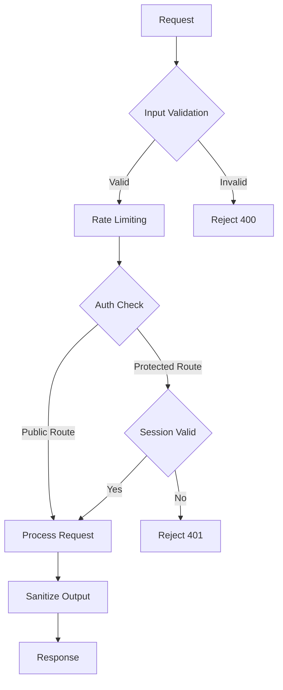
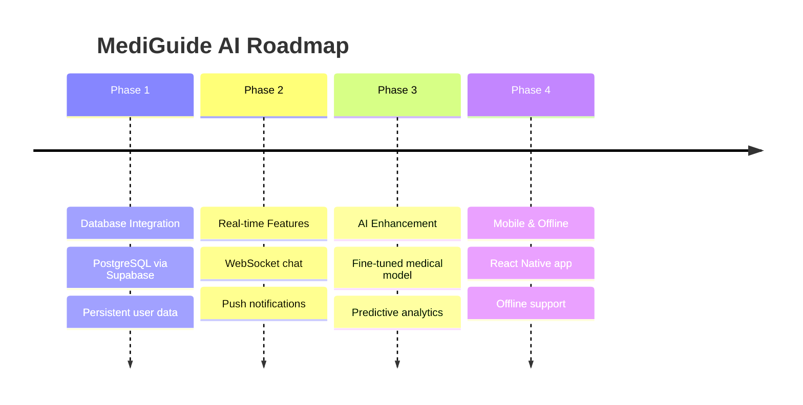

# MediGuide AI - System Architecture

## Overview

MediGuide AI is a full-stack healthcare platform built with Next.js 14, leveraging Google's Gemini AI for intelligent symptom analysis.

---

## Architecture Diagram

```mermaid
graph TB
    subgraph CLIENT["Client Layer"]
        BROWSER[Browser]
        HOME[Home Page]
        SYMPTOM[Symptom Checker]
        HOSPITAL[Hospital Finder]
        MARKET[Marketplace]
        ADMIN[Admin Dashboard]
    end

    subgraph APP["Application Layer - Next.js 14"]
        ROUTER[App Router]
        THEME[ThemeProvider]
        LANG[LanguageProvider]
        LAYOUT[PublicLayout]
    end

    subgraph API["API Layer"]
        ANALYZE[/api/symptoms/analyze]
        EMERGENCY[/api/symptoms/emergency]
        AUTH[/api/auth/*]
        PROFILE[/api/profile/*]
    end

    subgraph EXTERNAL["External Services"]
        GEMINI[Google Gemini AI]
        GEO[Geolocation API]
        LOCAL[LocalStorage]
    end

    CLIENT --> APP
    APP --> API
    API --> EXTERNAL
    
    BROWSER --> HOME
    BROWSER --> SYMPTOM
    BROWSER --> HOSPITAL
    BROWSER --> MARKET
    BROWSER --> ADMIN
    
    ROUTER --> THEME
    THEME --> LANG
    LANG --> LAYOUT
    
    SYMPTOM --> ANALYZE
    SYMPTOM --> EMERGENCY
    HOSPITAL --> GEO
    ADMIN --> AUTH
    ADMIN --> PROFILE
    
    ANALYZE --> GEMINI
    LOCAL -.-> LANG
```

---

## Data Flow Diagram



---

## Component Architecture



---

## Directory Structure

```
MediGuide AI/
├── app/
│   ├── (auth)/
│   │   ├── layout.tsx
│   │   ├── signin/page.tsx
│   │   └── signup/page.tsx
│   ├── (dashboard)/
│   │   ├── layout.tsx
│   │   └── profile/page.tsx
│   ├── api/
│   │   ├── auth/
│   │   │   ├── [...nextauth]/route.ts
│   │   │   ├── register/route.ts
│   │   │   ├── verify-email/route.ts
│   │   │   └── reset-password/route.ts
│   │   ├── symptoms/
│   │   │   ├── analyze/route.ts
│   │   │   └── emergency/route.ts
│   │   └── profile/
│   │       ├── personal/route.ts
│   │       ├── health/route.ts
│   │       └── emergency-contacts/route.ts
│   ├── admin/
│   │   ├── page.tsx
│   │   ├── analytics/page.tsx
│   │   ├── medicines/page.tsx
│   │   └── users/page.tsx
│   ├── symptom-checker/page.tsx
│   ├── hospital-finder/page.tsx
│   ├── marketplace/page.tsx
│   ├── emergency-hotlines/page.tsx
│   ├── checkout/page.tsx
│   ├── order-tracking/page.tsx
│   ├── settings/page.tsx
│   ├── layout.tsx
│   └── page.tsx
├── components/
│   ├── layout/
│   │   ├── Header.tsx
│   │   └── LayoutWrapper.tsx
│   └── providers/
│       └── index.tsx
├── lib/
│   └── LanguageContext.tsx
├── public/
├── .env.local
├── package.json
├── tailwind.config.js
└── tsconfig.json
```

---

## API Endpoints

### Symptom Analysis



| Endpoint | Method | Description |
|----------|--------|-------------|
| `/api/symptoms/analyze` | POST | AI-powered symptom analysis |
| `/api/symptoms/emergency` | POST | Emergency keyword detection |
| `/api/auth/register` | POST | User registration |
| `/api/auth/verify-email` | POST | Email verification |
| `/api/auth/reset-password` | POST | Password reset |
| `/api/profile` | GET/PUT | User profile management |

---

## Authentication Flow



---

## Emergency Detection System



---

## State Management

```mermaid
graph LR
    subgraph CONTEXT[React Context]
        LANG_CTX[LanguageContext]
        THEME_CTX[ThemeProvider]
    end
    
    subgraph LOCAL[LocalStorage]
        LANG_DATA[language: en|hi|mr]
        USER_DATA[currentUser: {...}]
        CART_DATA[mediguide_cart: [...]]
    end
    
    LANG_CTX -->|persist| LANG_DATA
    LANG_DATA -->|hydrate| LANG_CTX
    
    USER_DATA -->|read| AUTH_STATE[Auth State]
    CART_DATA -->|read| CART_STATE[Cart State]
```

---

## Deployment Architecture



---

## Tech Stack

| Layer | Technology | Version |
|-------|------------|---------|
| Framework | Next.js | 14.2.3 |
| UI Library | React | 18.3.1 |
| Language | TypeScript | 5.4.5 |
| Styling | Tailwind CSS | 3.4.1 |
| AI | Google Gemini AI | 0.24.1 |
| Forms | React Hook Form | 7.81.0 |
| Validation | Zod | 4.4.3 |
| Animation | Framer Motion | 10.16.16 |
| Icons | Lucide React | 0.378.0 |

---

## Security



- All inputs validated with Zod schemas
- Rate limiting on API routes
- Password hashing with bcrypt
- HTTPS enforced in production
- No permanent medical data storage

---

## Future Roadmap



---

*Architecture documentation last updated: July 2024*
